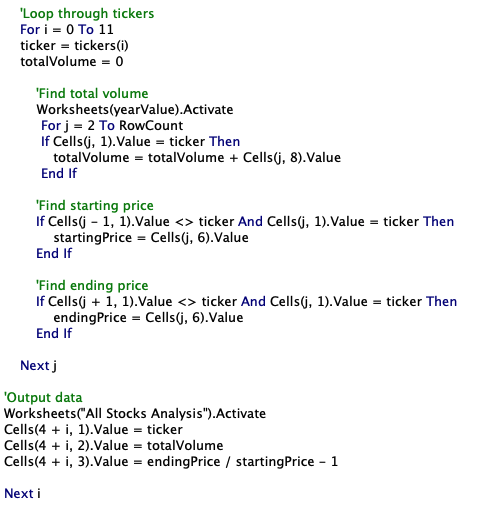
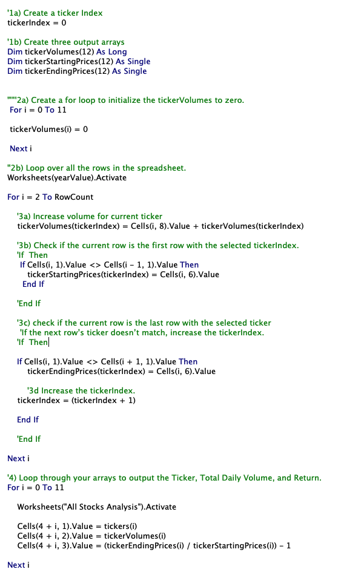
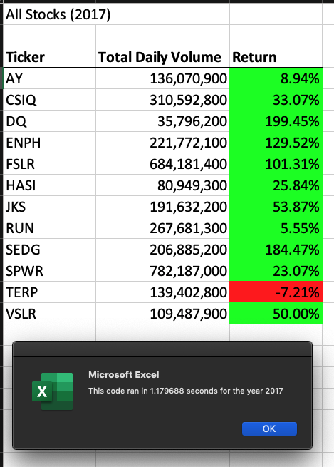
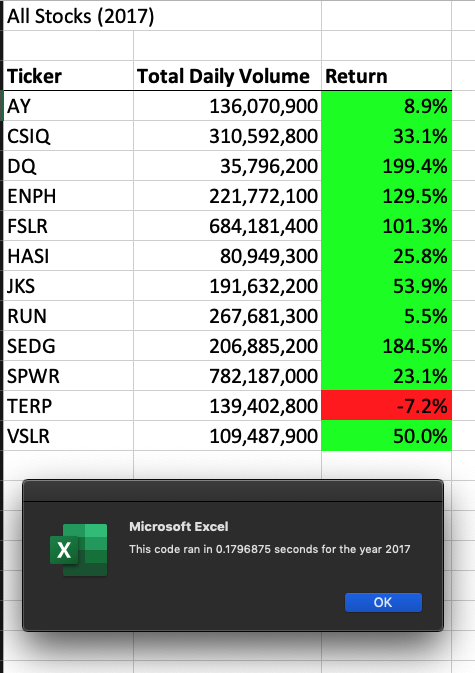
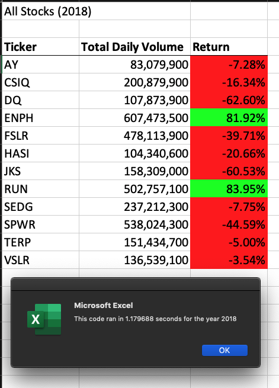
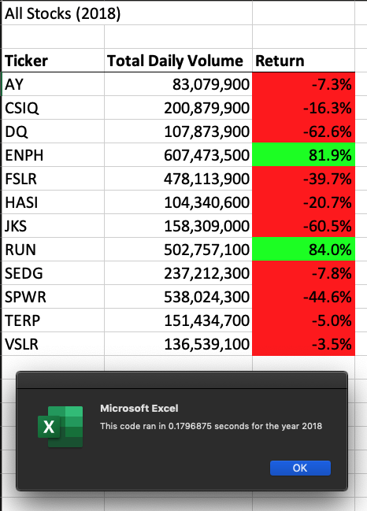

# Stock_Analysis
# Overview: 
Using VBA and a subset of available stocks to help Steve, a financial advisor, would like to provide data-driven stock trading recommendations to his clients and help Steve to evaluate more stocks and will need to use more efficient programs.

#Resources
Program A: Nested For Loops

Program B: Single For Loop

# Performance:
## 2017

### 2018

# Summary:
In Program A, you'd need to update a single array, the index reference in the 'calculations' for loop, and the data output rows. 
In Program B, you'd need to update the length for 3 arrays, the index reference in the 'calculations' for loop, the index reference in the output for loop, and the data output rows. That makes Program B more difficult to update than Program A. Steve would need to evaluate what program properties are most important to him when deciding which program to adopt.
